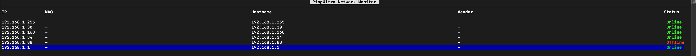

# PingUltra

[](https://github.com/guonaihong/pingultra/actions/workflows/ci.yml)
[](https://opensource.org/licenses/MIT)

PingUltra 是一个用 Rust 实现的高性能网络 ping 工具，是 fping 的兼容升级版本。它支持并行 ping 多个主机，提供丰富的统计信息和多种输出格式。

## 特性

- 高性能并行 ping 多个主机
- 支持 IPv4 和 IPv6
- 自定义 ICMP 包大小
- 可配置的超时和重试机制
- 多种输出格式（文本、JSON、CSV）
- 详细的统计信息
- 支持从文件读取目标主机列表
- **内网设备监控**：检测局域网中设备的新增和消失
- **交互式字符界面**：提供美观、高效的终端UI，支持设备状态实时显示


## 系统要求

### 支持的平台
- ✅ Linux
- ✅ macOS
- ⚠️ Windows（需要安装 [Npcap](https://npcap.com/) 或 WinPcap，且功能可能受限）

### 依赖
- **Linux**: 需要安装 `libpcap-dev`
  ```bash
  # Ubuntu/Debian
  sudo apt-get install libpcap-dev
  
  # Fedora/RHEL
  sudo dnf install libpcap-devel
  ```
- **macOS**: 系统自带 libpcap，无需额外安装
- **Windows**: 需要安装 [Npcap](https://npcap.com/)（推荐）或 WinPcap

## 安装

### 使用 cargo install（推荐）

最简单的安装方式是从 crates.io 安装：

```bash
cargo install pingultra
```

或者从 GitHub 源码安装最新版本：

```bash
cargo install --git https://github.com/guonaihong/pingultra.git
```

安装完成后，可以直接运行（需要 root 权限）：

```bash
sudo pingultra 8.8.8.8
```

### 从源码编译

如果你想手动编译和安装：

确保你已经安装了 Rust 和 Cargo：

```bash
# 克隆仓库
git clone https://github.com/guonaihong/pingultra.git
cd pingultra

# 编译
cargo build --release

# 安装到系统路径（可选）
sudo cp target/release/pingultra /usr/local/bin/
```

编译完成后，可以通过以下方式运行：

```bash
# 使用编译后的二进制文件
sudo ./target/release/pingultra 8.8.8.8

# 或者安装到系统路径后
sudo pingultra 8.8.8.8
```

## 使用方法

由于 PingUltra 需要创建原始套接字（raw socket）来发送 ICMP 包，所以在大多数系统上需要 root 权限运行：

```bash
# 基本用法
sudo pingultra 8.8.8.8

# 指定 ping 次数
sudo pingultra -c 5 8.8.8.8

# 同时 ping 多个主机
sudo pingultra 8.8.8.8 1.1.1.1 example.com

# 从文件读取目标主机
sudo pingultra -f hosts.txt

# 设置超时时间（毫秒）
sudo pingultra -w 1000 8.8.8.8

# 设置 ping 间隔（毫秒）
sudo pingultra -p 500 8.8.8.8

# 设置 ICMP 包大小
sudo pingultra -s 100 8.8.8.8

# 设置 TTL 值
sudo pingultra -t 32 8.8.8.8

# 生成 JSON 格式的摘要报告
sudo pingultra 8.8.8.8 summary --format json

# 监控内网设备变化（新增/消失）
sudo pingultra monitor -n 192.168.1.0/24

# 监控内网设备变化，并解析 MAC 地址厂商信息
sudo pingultra monitor -n 192.168.1.0/24 -m

# 只显示设备变化（新增/消失），不显示稳定设备
sudo pingultra monitor -n 192.168.1.0/24 --changes-only

# 使用交互式字符界面监控设备
sudo pingultra monitor -n 192.168.1.0/24 -u -i 1
```

## 命令行选项

```
选项:
  -f, --file <FILE>          从文件读取目标主机
  -c, --count <COUNT>        发送 ping 的次数 [默认: 3]
  -p, --period <PERIOD>      ping 间隔时间（毫秒）[默认: 1000]
  -w, --timeout <TIMEOUT>    超时时间（毫秒）[默认: 5000]
  -r, --retry <RETRY>        失败重试次数 [默认: 1]
  -s, --size <SIZE>          ICMP 包大小（字节）[默认: 56]
  -t, --ttl <TTL>            生存时间值 [默认: 64]
  -q, --quiet                安静模式 - 只显示摘要
  -T, --timestamp            显示时间戳
  -h, --help                 显示帮助信息
  -V, --version              显示版本信息

子命令:
  summary                    生成摘要报告
  monitor                    监控内网设备变化
  help                       显示命令帮助
```

### 监控子命令选项

```
选项:
  -n, --network <NETWORK>    要扫描的 IP 范围（CIDR 格式，如 192.168.1.0/24）
  -i, --interval <INTERVAL>  扫描间隔时间（秒）[默认: 60]
  -f, --format <FORMAT>      输出格式（text, json, csv）[默认: text]
  -c, --changes-only         只显示变化（不显示稳定设备）
  -m, --resolve-mac          尽可能解析 MAC 地址到厂商名称
  -u, --ui                   使用交互式字符界面显示设备状态
```

## 字符界面使用指南

当使用 `-u` 选项启动监控时，将进入交互式字符界面模式。在此模式下：

- **q 或 ESC**：退出程序（在详情页面返回列表）
- **Enter**：查看选中设备的详情页面
- **s**：切换排序方式（按IP地址排序/按设备状态排序）
- **↑/↓ 或 j/k**：导航设备列表（列表模式）或滚动详情（详情模式）

### 设备状态说明

界面会显示设备的以下状态：

- **Online**：设备在线（🟢 绿色）- 正常响应 ping
- **Unstable**：设备不稳定（🟡 黄色）- 连续失败 2 次，表示短暂连不上
- **Offline**：设备离线（🔴 红色）- 连续失败 5 次
- **New**：新发现的设备（🟡 黄色）- 首次发现
- **Lost**：长时间未响应的设备（⚠️ 红色加粗）- 长期离线

### 短暂离线监控

PingUltra 现在可以精确追踪设备的短暂连不上情况：

- **连续失败计数**：显示设备连续失败的 ping 次数
- **离线事件历史**：记录每次离线事件的开始时间、恢复时间和持续时长
- **不稳定设备识别**：当设备连续失败 2 次时，状态变为 "Unstable"，便于快速识别网络不稳定的设备

### 底部统计信息

底部显示实时统计：
```
设备总数: 25 | 在线: 23 | 不稳定: 1 | 离线: 1 | 新设备: 0 | 丢失: 0
```

### 设备详情页面

按 `Enter` 键查看选中设备的详细信息，包括：

```
┌─ 192.168.1.101 详情 ─────────────────────────────────┐
│ MAC: aa:bb:cc:dd:ee:ff                               │
│ 厂商: Apple Inc.                                      │
│ Hostname: iphone-user                                │
│ 状态: Unstable (连续失败 2 次)                        │
│                                                      │
│ 离线事件历史:                                        │
│ ┌─────────────────────────────────────────────────┐ │
│ │ #1 | 11:23:45 - 11:24:12 | 27s  | 恢复 ✓       │ │
│ │ #2 | 11:25:10 - 11:25:18 | 8s   | 恢复 ✓       │ │
│ │ #3 | 11:26:00 - (进行中) | 45s  | 离线中 ⏱️   │ │
│ └─────────────────────────────────────────────────┘ │
│                                                      │
│ 统计: 共 3 次离线，平均时长 13.7s                    │
└──────────────────────────────────────────────────────┘
```

**详情页面显示**：
- 设备 MAC 地址和厂商信息
- 主机名
- 当前状态和连续失败次数
- 完整的离线事件历史（包括离线时间、恢复时间、持续时长）
- 离线统计信息（总次数和平均时长）

## 项目结构

```
src/
├── cli.rs         # 命令行参数处理
├── error.rs       # 错误类型定义
├── host.rs        # 主机和响应处理
├── icmp.rs        # ICMP 包构造和解析
├── main.rs        # 程序入口
├── monitor.rs     # 内网设备监控功能
├── output.rs      # 输出格式化
├── pinger.rs      # 核心 ping 功能实现
├── stats.rs       # 统计信息收集和处理
└── ui.rs          # 交互式字符界面实现
```

## 性能

PingUltra 使用 Rust 的异步编程模型和高效的网络库，能够以最小的资源消耗同时 ping 大量主机。与传统的 ping 工具相比，PingUltra 在处理大量主机时表现出色。

## 功能特性

### SQLite 数据库持久化

使用 `-u` 启用 UI 模式时，所有离线事件会自动保存到 SQLite 数据库（`pingultra_monitor.db`），包括：

- 离线事件的开始和结束时间
- 离线持续时长
- 历史离线次数统计

这样你可以查看设备的完整离线历史，而不仅仅是当前会话的数据。

## 设计文档

- [短暂连不上 IP 监控 - 快速开始](./QUICK_START_UNSTABLE.md) - 快速上手指南

## 贡献

欢迎提交 Pull Request 或 Issue 来帮助改进这个项目。

## 许可证

MIT License
